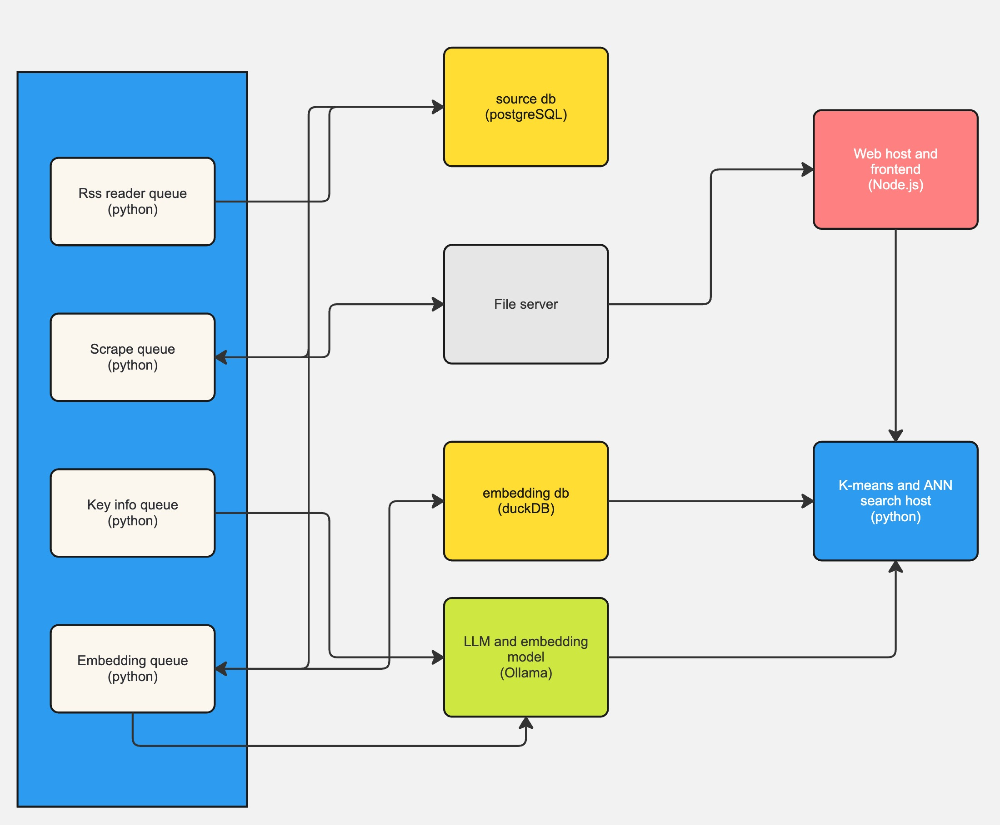
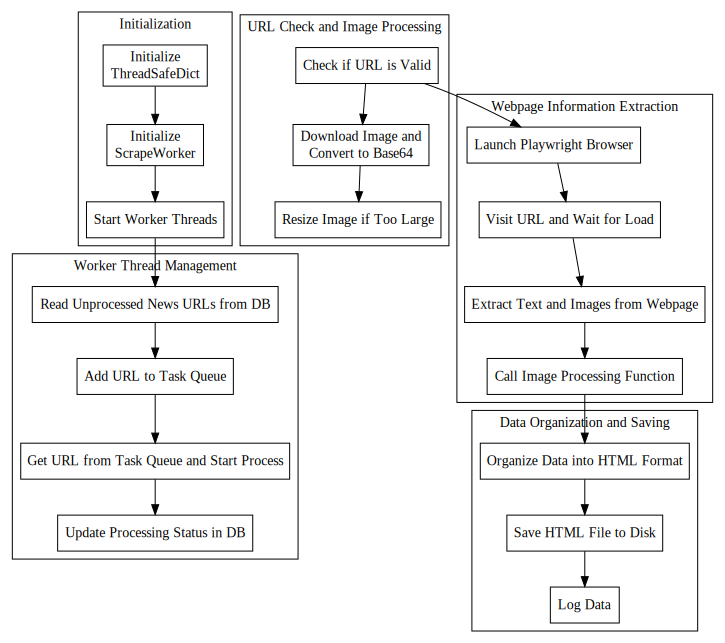
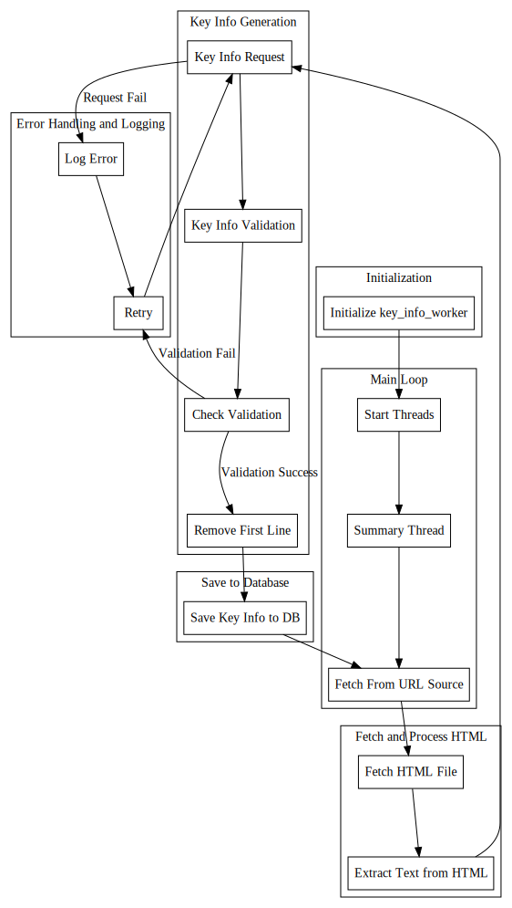

# News Hub: AI Powered News App

## Overview

**News Hub** is an AI-powered news application currently under development, with a demo available during interviews. The app aims to reorganize and eliminate biased opinions from various news sources, providing users with an unbiased and comprehensive news experience.

this is the first part of the project, handled reading from the news sources and scrape content with the url, also create ai content and text-embedding

## Features

- **AI Integration**: Utilizes advanced AI technologies, including Ollama, text embedding, KNN (K-Nearest Neighbors), and K-means clustering, to analyze and categorize news content.
- **Bias Removal**: Implements sophisticated algorithms to detect and remove biased opinions, ensuring a balanced presentation of news.

## Technical Details

- \*\*The red one is this repository; the others are set to private. Contact me for more information.
  

  #scrape queue
  

  #extract key infomation queue
  

### Technologies and Tools

- **AI and Machine Learning**:

  - Ollama for advanced language understanding
  - Text embedding for semantic analysis
  - KNN and K-means for data clustering and organization

- **Programming Languages**:

  - Python
  - Node.js
  - HTML
  - JavaScript
  - Linux shell scripting
  - SQL

- **DevOps and System Administration**:
  - Virtual Machines (VM)
  - Networking
  - Comprehensive API integrations

### Core Competencies

- **Autonomy and Problem-Solving**:
  - Demonstrates the ability to work independently, solving complex problems efficiently.
  - Applies architectural thinking to develop robust and scalable software systems.

## Installation

To install and run the News Hub demo, follow these steps:

1. Clone the repository:

   ```bash
   git clone https://github.com/hector918/news_webhost_and_frontend.git
   ```

2. Navigate to the project directory:

   ```bash
   cd news_webhost_and_frontend
   ```

3. Install the necessary dependencies:

   ```bash
   npm install
   ```

4. You will need the .env that Includes

   ```bash
   WEB_PORT=
   SSL_KEY_PATH='./ssl/key.pem'
   SSL_CERT_PATH='./ssl/cert.pem'
   EMAIL=
   EMAIL_PASSWORD=
   SESSION_SECRET=
   SESSION_DB_URL=
   WEB_HOST_DB_URL=
   LOGGING_DB_URL=
   ```

5. Run the application:

   ```bash
    node server.js
   ```

## License

This project is licensed under the Apache License Version 2.0. See the `LICENSE` file for details.

## Contact

For any inquiries or further information, please contact us at [qihectorzhong@pursuit.org](mailto:qihectorzhong@pursuit.org).

---

Thank you for using News Hub! We look forward to providing you with an unbiased and comprehensive news experience.
